# HVAC AI Voice Agent — Project Task Backlog

> **Project**: Pipecat HVAC AI Voice Agent  
> **Date**: 2026-09-12  
> **Current State**: Core pipeline built (Twilio → Deepgram STT → GPT-4o-mini → Cartesia TTS), MCP server with Redis locking and Frappe CRM proxy, local WebRTC testing available. Frappe CRM Docker setup in progress.

---

## Legend

| Symbol | Meaning |
|--------|---------|
| `[ ]` | Not started |
| `[/]` | In progress |
| `[x]` | Completed |
| 🔧 | Technical task |
| 💼 | Business task |
| 🔬 | Research task |
| ⭐ | Task **added by agent** (not in original list) |

---

## P0 — Critical Path (Do These First)

> These tasks are blocking revenue generation. Nothing else matters until these are done.

---

### 1. 🔧 Dockerize All Services
**Description**: Create a unified Docker Compose setup that spins up Redis, the MCP Server, the FastAPI server, and the Frappe CRM with a single command. Currently, 4 separate terminals are needed.  
**Effort**: 1–2 days  
**Dependencies**: None  
**Acceptance Criteria**:
- [ ] Single `docker compose up` command starts all services
- [ ] Health checks for Redis, MCP Server, and FastAPI
- [ ] `.env` file is mounted (not baked into images)
- [ ] `docker-compose.yml` at project root orchestrates everything
- [ ] Frappe CRM container from `frappe-crm/` is integrated

> [!NOTE]
> A [Dockerfile](file:///home/zyada/pipecat-quickstart/server/Dockerfile) already exists in `server/`. The Frappe CRM has its own [docker-compose.yml](file:///home/zyada/pipecat-quickstart/frappe-crm/docker-compose.yml). These need to be unified.

---

### 2. 🔧 Host on a Publicly Accessible VM
**Description**: Deploy the Dockerized stack to a remote VM (e.g., AWS EC2, GCP Compute, Hetzner, DigitalOcean) so Twilio can reach it without ngrok.  
**Effort**: 1–2 days  
**Dependencies**: Task 1 (Dockerize)  
**Acceptance Criteria**:
- [ ] All services running on a public VM with a static IP or domain
- [ ] HTTPS via reverse proxy (Caddy or Nginx + Let's Encrypt)
- [ ] Twilio webhook pointed to `https://your-domain.com/twiml`
- [ ] No dependency on ngrok for production calls
- [ ] Firewall rules configured (only expose ports 443 and SSH)

---

### 3. 🔧 Connect Pipecat to Telephony Provider (Twilio)
**Description**: Complete the Twilio integration end-to-end: purchase a phone number, configure the webhook, and validate that inbound calls reach the agent and produce a full conversation.  
**Effort**: 0.5–1 day  
**Dependencies**: Task 2 (VM Hosting)  
**Acceptance Criteria**:
- [ ] Twilio number purchased and configured
- [ ] Inbound calls routed to the FastAPI `/twiml` endpoint
- [ ] Full voice conversation works (STT → LLM → TTS loop)
- [ ] Call recording enabled for QA purposes

---

### 4. 💼 Create a Pricing Scheme
**Description**: Define the business model. Options to evaluate:  
- **Pay-as-you-go**: Per-minute or per-call pricing  
- **Monthly subscription**: Flat fee + overages beyond a usage cap  
- **Tiered plans**: Starter / Growth / Enterprise with different feature sets  

**Effort**: 1–2 days (research + decision)  
**Dependencies**: None (can be done in parallel)  
**Deliverables**:
- [ ] Cost analysis spreadsheet (API costs per call: Deepgram, OpenAI, Cartesia, Twilio)
- [ ] Margin calculation at different volume tiers
- [ ] Pricing page copy / one-pager for prospects
- [ ] Decision on billing infrastructure (Stripe, etc.)

> [!IMPORTANT]
> You need to know your per-call cost before you can price the service. Calculate the blended cost of a 3-minute call across all APIs (Deepgram STT, OpenAI LLM, Cartesia TTS, Twilio telephony).

---

### 5. 💼 Get Lead List from Melo
**Description**: Obtain the target prospect list from Melo for cold outreach. Ensure the list includes company name, contact name, phone number, and any qualifying info.  
**Effort**: 0.5 day  
**Dependencies**: None  
**Acceptance Criteria**:
- [ ] Lead list received in a structured format (CSV/spreadsheet)
- [ ] Data cleaned and deduplicated
- [ ] Leads categorized by priority / fit

---

### 6. 💼 Create a Cold Calling Script
**Description**: Write the actual cold calling script that **you** (the human) will use when calling HVAC businesses to sell the AI agent service. This is your sales pitch, not the AI agent's script.  
**Effort**: 0.5–1 day  
**Dependencies**: Task 4 (Pricing — you need to know what you're selling at what price)  
**Deliverables**:
- [ ] Opening hook (first 10 seconds)
- [ ] Value proposition (pain point → solution)
- [ ] Objection handling matrix (top 5 objections)
- [ ] Call-to-action / close (demo booking)
- [ ] Follow-up email template

---

### 7. 💼 Make the First Call
**Description**: Pick up the phone and call the first prospect from the Melo lead list using the cold calling script.  
**Effort**: Ongoing  
**Dependencies**: Tasks 5 + 6 (Lead list + Script)  
**Acceptance Criteria**:
- [ ] At least 10 calls made in the first session
- [ ] Feedback loop: refine the script after every 5 calls
- [ ] Track outcomes (interested / not interested / callback / demo booked)

---

## P1 — Core Product (Build a Demo-Ready Product)

> These tasks turn the prototype into something you can actually demo to prospects.

---

### 8. 🔧 Create a Demo Agent Ready for Cold Call Demos
**Description**: Build a polished demo instance where a prospect can call a phone number live during your sales pitch and interact with the AI agent. The demo should showcase booking, triage, and personality.  
**Effort**: 2–3 days  
**Dependencies**: Tasks 1, 2, 3 (infra must be live)  
**Acceptance Criteria**:
- [ ] Dedicated demo phone number (separate from production)
- [ ] Pre-loaded with a sample HVAC business profile
- [ ] Handles a complete booking flow end-to-end
- [ ] Sounds natural, professional, and impressive
- [ ] Resets state between demo calls (no stale bookings)

---

### 9. 🔧 Ensure MCP Tool Correctly Checks Availability & Returns Consistent JSON
**Description**: The `check_and_book_slot` MCP tool must validate availability against the Frappe CRM every single time (not hallucinate), and return a specific, structured JSON response regardless of success/failure.  
**Effort**: 1–2 days  
**Dependencies**: Frappe CRM running  
**Acceptance Criteria**:
- [ ] Tool queries Frappe CRM for existing bookings before attempting to book
- [ ] Response schema is consistent: `{ "status": "success|error|conflict", "message": "...", "slot": {...} }`
- [ ] Unit tests covering: successful booking, double-booking attempt, past date, invalid time, CRM down
- [ ] Redis lock works correctly under concurrent requests

---

### 10. 🔧 Book Appointments Correctly & Send Text Verification to Business Owner
**Description**: When an appointment is booked, send a verification message to the business owner (the HVAC company, your customer) so they can confirm or reject the booking.  
**Effort**: 3–5 days  
**Dependencies**: Task 9 (reliable booking)  
**Sub-tasks**:
- [ ] SMS/WhatsApp notification sent to business owner on booking
- [ ] Message includes: customer name, phone, date, time, service type, issue description
- [ ] Owner can reply to confirm or reject (simple SMS reply or WhatsApp quick-reply)
- [ ] Booking status updated in Frappe CRM based on owner's response

> [!NOTE]
> WhatsApp Business API with quick-reply/CTA buttons is the ideal UX but requires Meta Business verification. Start with simple Twilio SMS as an MVP, then upgrade to WhatsApp later.

---

### 11. 🔧 Build a Booking Calendar into the Service (Frappe Calendar)
**Description**: Instead of relying on external calendar integrations, build the scheduling calendar directly into the Frappe CRM instance. This becomes the source of truth for technician availability.  
**Effort**: 3–5 days  
**Dependencies**: Frappe CRM running  
**Acceptance Criteria**:
- [ ] Calendar view in Frappe showing technician schedules
- [ ] `TechnicianSchedule` DocType supports CRUD operations via API
- [ ] Availability is derived from the calendar (not hardcoded)
- [ ] Business hours, blocked slots, and holidays are configurable
- [ ] API endpoint that the MCP server calls to check real availability

> [!TIP]
> Integration with Google Calendar, Outlook, Cal.com etc. can be Phase 2. Keep Frappe as the canonical source for now.

---

### 12. 🔧 Create an Escalation Matrix
**Description**: Define what happens when the AI agent cannot resolve a situation: e.g., the caller is angry, the issue is outside HVAC, all slots are booked, the system errors out.  
**Effort**: 1–2 days  
**Dependencies**: None  
**Deliverables**:
- [ ] Escalation rules document (trigger → action)
- [ ] Implementation in the LLM system prompt
- [ ] At minimum: transfer to human, callback promise, supervisor notification
- [ ] Edge cases: abusive caller, language barrier, medical emergency mentioned

**Example matrix**:
| Trigger | Action |
|---------|--------|
| All slots booked for the day | Apologize, offer next available day, log callback request |
| Caller is angry / abusive | De-escalate once, then offer human transfer |
| Issue is not HVAC-related | Politely redirect, do not book |
| System error (CRM down) | Play fallback message (already implemented in [error_handlers.py](file:///home/zyada/pipecat-quickstart/server/error_handlers.py)) |
| Caller mentions emergency / danger | Advise calling 911/emergency services immediately |

---

## P2 — Product Quality (Make It Great)

> These tasks improve the agent's conversational quality, reliability, and trustworthiness.

---

### 13. 🔧 Create Guardrails to Avoid Hallucinations
**Description**: Prevent the LLM from inventing availability, making up technician names, or providing medical/legal advice. Currently `temperature=0.1` is the only mitigation.  
**Effort**: 2–3 days  
**Dependencies**: None  
**Implementation ideas**:
- [ ] System prompt hardening: explicit "never invent" instructions with examples
- [ ] Tool-forcing: require the LLM to call `check_and_book_slot` before confirming anything
- [ ] Output validation layer: intercept LLM responses and flag suspicious patterns
- [ ] Structured outputs (JSON mode) for booking confirmations
- [ ] ⭐ Add a "fact-checking" MCP tool that the LLM can call to verify its own statements

---

### 14. 🔧 Make the Agent More Natural Sounding
**Description**: Tune the agent's voice and speech patterns to sound less robotic. Leverage prompt engineering and TTS settings.  
**Effort**: 1–2 days  
**Dependencies**: None  
**Implementation ideas**:
- [ ] Prompt engineering: "Speak at a natural conversational pace", "Use casual contractions", "Mirror the caller's energy"
- [ ] Experiment with different Cartesia voice IDs (currently using `71a7ad14...`)
- [ ] Adjust Cartesia speed/stability settings if available
- [ ] Add filler words and acknowledgments ("Mmhmm", "Got it", "Sure thing")
- [ ] Test with a western/southern US accent voice for the HVAC demographic

---

### 15. 🔧 Give the Agent an Actual Personality
**Description**: The agent should have a defined persona — a name, a backstory, consistent tone, and behavioral patterns. This makes the experience memorable and builds trust.  
**Effort**: 1 day  
**Dependencies**: None  
**Deliverables**:
- [ ] Persona document: name, role title, personality traits, communication style
- [ ] Updated system prompt in [pipeline_builder.py](file:///home/zyada/pipecat-quickstart/server/pipeline_builder.py) reflecting the persona
- [ ] Consistent greeting and sign-off phrases
- [ ] Personality-appropriate responses to edge cases (humor? empathy? urgency?)

---

### 16. 🔬 Figure Out How to Receive Inbound Calls from Prospects
**Description**: Research and implement the full inbound call flow — how does a prospect (the HVAC company's customer) actually reach your AI agent?  
**Effort**: 1–2 days (research) + implementation  
**Dependencies**: Task 3 (Twilio connected)  
**Questions to answer**:
- [ ] Does each HVAC business get their own dedicated Twilio number?
- [ ] Or do we use a single number with IVR routing / SIP trunking?
- [ ] Can we do call forwarding from the HVAC company's existing number?
- [ ] What about after-hours routing vs. business-hours routing?
- [ ] How does multi-tenancy work? (one agent instance per customer, or shared?)

---

## P3 — Scale & Polish (Nice-to-Haves)

> These tasks are important but only after the core product is live and you have paying customers.

---

### 17. 🔧 WhatsApp Bot with Quick-Reply/CTA Buttons for Owner Verification
**Description**: Upgrade the business owner notification (Task 10) from basic SMS to a WhatsApp Business API integration with interactive quick-reply buttons (Accept / Reject).  
**Effort**: 3–5 days  
**Dependencies**: Task 10 (basic SMS verification working first)  
**Acceptance Criteria**:
- [ ] WhatsApp Business API account set up and verified
- [ ] Templated message sent on booking with Accept/Reject buttons
- [ ] Webhook handler for button responses
- [ ] Booking status updated in Frappe CRM automatically

---

### 18. 🔧 External Calendar Integrations
**Description**: Allow HVAC businesses to sync the Frappe booking calendar with Google Calendar, Outlook, or Cal.com.  
**Effort**: 3–5 days per integration  
**Dependencies**: Task 11 (Frappe calendar as source of truth)  

---

### 19. ⭐ 🔧 Add Call Analytics & Recording Dashboard
**Description**: Build a dashboard for HVAC business owners to see call volume, booking rates, average call duration, and listen to call recordings.  
**Effort**: 3–5 days  
**Dependencies**: Tasks 2, 3 (live calls)  
**Rationale**: This is a major selling point — business owners want visibility into what the AI is doing.

---

### 20. ⭐ 🔧 Multi-Tenancy Support
**Description**: Support multiple HVAC businesses on a single deployment. Each business gets their own phone number, calendar, and agent persona.  
**Effort**: 5–7 days  
**Dependencies**: Tasks 11, 15 (calendar + personality per tenant)  
**Rationale**: Essential for scaling beyond a single customer. Without this, every new customer requires a separate deployment.

---

### 21. ⭐ 💼 Build a Landing Page / Website
**Description**: Create a marketing website that explains the service, shows pricing, and lets prospects book a demo.  
**Effort**: 2–3 days  
**Dependencies**: Task 4 (pricing finalized)  
**Rationale**: You need somewhere to send prospects after the cold call.

---

### 22. ⭐ 🔧 Implement Billing & Usage Tracking
**Description**: Set up Stripe (or equivalent) to charge customers based on the pricing scheme. Track per-call usage and enforce plan limits.  
**Effort**: 3–5 days  
**Dependencies**: Task 4 (pricing scheme)  
**Rationale**: You can't charge customers without a billing system.

---

### 23. ⭐ 🔧 Add Monitoring, Logging & Alerting
**Description**: Set up structured logging, error alerting (PagerDuty/Slack), and uptime monitoring so you know when things break before your customers do.  
**Effort**: 1–2 days  
**Dependencies**: Task 2 (VM hosting)  
**Rationale**: Production systems need observability. A dropped call at 2am on a Saturday during a heatwave is a disaster.

---

### 24. ⭐ 🔬 Research Outbound Calling Capabilities
**Description**: Investigate whether the agent can make outbound calls (e.g., confirmation calls, follow-ups, appointment reminders) in addition to handling inbound.  
**Effort**: 1–2 days (research)  
**Dependencies**: Task 3 (Twilio connected)  
**Rationale**: Outbound calling is a natural upsell and high-value feature for HVAC businesses.

---

## Summary View

| Priority | # | Task | Type | Effort | Status |
|----------|---|------|------|--------|--------|
| **P0** | 1 | Dockerize all services | 🔧 | 1–2d | `[ ]` |
| **P0** | 2 | Host on public VM | 🔧 | 1–2d | `[ ]` |
| **P0** | 3 | Connect Twilio end-to-end | 🔧 | 0.5–1d | `[ ]` |
| **P0** | 4 | Create pricing scheme | 💼 | 1–2d | `[ ]` |
| **P0** | 5 | Get lead list from Melo | 💼 | 0.5d | `[ ]` |
| **P0** | 6 | Create cold calling script | 💼 | 0.5–1d | `[ ]` |
| **P0** | 7 | Make the first call | 💼 | Ongoing | `[ ]` |
| **P1** | 8 | Demo agent for live demos | 🔧 | 2–3d | `[ ]` |
| **P1** | 9 | MCP tool: consistent JSON & availability checks | 🔧 | 1–2d | `[ ]` |
| **P1** | 10 | Booking verification to owner (SMS) | 🔧 | 3–5d | `[ ]` |
| **P1** | 11 | Frappe booking calendar | 🔧 | 3–5d | `[ ]` |
| **P1** | 12 | Escalation matrix | 🔧 | 1–2d | `[ ]` |
| **P2** | 13 | Guardrails against hallucinations | 🔧 | 2–3d | `[ ]` |
| **P2** | 14 | Natural-sounding agent | 🔧 | 1–2d | `[ ]` |
| **P2** | 15 | Agent personality | 🔧 | 1d | `[ ]` |
| **P2** | 16 | Inbound call routing research | 🔬 | 1–2d | `[ ]` |
| **P3** | 17 | WhatsApp quick-reply buttons | 🔧 | 3–5d | `[ ]` |
| **P3** | 18 | External calendar integrations | 🔧 | 3–5d/ea | `[ ]` |
| **P3** | 19 | Call analytics dashboard ⭐ | 🔧 | 3–5d | `[ ]` |
| **P3** | 20 | Multi-tenancy support ⭐ | 🔧 | 5–7d | `[ ]` |
| **P3** | 21 | Landing page / website ⭐ | 💼 | 2–3d | `[ ]` |
| **P3** | 22 | Billing & usage tracking ⭐ | 🔧 | 3–5d | `[ ]` |
| **P3** | 23 | Monitoring & alerting ⭐ | 🔧 | 1–2d | `[ ]` |
| **P3** | 24 | Outbound calling research ⭐ | 🔬 | 1–2d | `[ ]` |

---

## Dependency Graph

```mermaid
graph TD
    T1["1. Dockerize Services"] --> T2["2. Host on VM"]
    T2 --> T3["3. Connect Twilio"]
    T3 --> T8["8. Demo Agent"]
    T3 --> T16["16. Inbound Call Routing"]
    T3 --> T24["24. Outbound Calling Research"]
    
    T4["4. Pricing Scheme"] --> T6["6. Cold Calling Script"]
    T4 --> T21["21. Landing Page"]
    T4 --> T22["22. Billing System"]
    
    T5["5. Lead List from Melo"] --> T7["7. First Call"]
    T6 --> T7
    
    T9["9. MCP Tool Reliability"] --> T10["10. Owner Verification SMS"]
    T10 --> T17["17. WhatsApp Buttons"]
    
    T11["11. Frappe Calendar"] --> T18["18. External Calendars"]
    T11 --> T20["20. Multi-Tenancy"]
    T15["15. Agent Personality"] --> T20
    
    T2 --> T23["23. Monitoring"]
    T2 --> T19["19. Analytics Dashboard"]

    style T1 fill:#ff6b6b,color:#fff
    style T2 fill:#ff6b6b,color:#fff
    style T3 fill:#ff6b6b,color:#fff
    style T4 fill:#ff6b6b,color:#fff
    style T5 fill:#ff6b6b,color:#fff
    style T6 fill:#ff6b6b,color:#fff
    style T7 fill:#ff6b6b,color:#fff
    style T8 fill:#ffa502,color:#fff
    style T9 fill:#ffa502,color:#fff
    style T10 fill:#ffa502,color:#fff
    style T11 fill:#ffa502,color:#fff
    style T12 fill:#ffa502,color:#fff
    style T13 fill:#2ed573,color:#fff
    style T14 fill:#2ed573,color:#fff
    style T15 fill:#2ed573,color:#fff
    style T16 fill:#2ed573,color:#fff
    style T17 fill:#70a1ff,color:#fff
    style T18 fill:#70a1ff,color:#fff
    style T19 fill:#70a1ff,color:#fff
    style T20 fill:#70a1ff,color:#fff
    style T21 fill:#70a1ff,color:#fff
    style T22 fill:#70a1ff,color:#fff
    style T23 fill:#70a1ff,color:#fff
    style T24 fill:#70a1ff,color:#fff
```

> 🔴 P0 Critical | 🟠 P1 Core | 🟢 P2 Quality | 🔵 P3 Scale

---

## Suggested Sprint Plan

### Sprint 1 (Week 1): "Get Live"
Tasks 1, 2, 3, 4, 5 — Dockerize → Deploy → Connect Twilio → Pricing → Lead List

### Sprint 2 (Week 2): "Start Selling"
Tasks 6, 7, 8, 9 — Cold calling script → First calls → Demo agent → MCP reliability

### Sprint 3 (Week 3): "Product Depth"
Tasks 10, 11, 12, 13 — Owner verification → Calendar → Escalation → Guardrails

### Sprint 4 (Week 4): "Polish & Personality"
Tasks 14, 15, 16 — Natural voice → Personality → Inbound routing research

### Backlog (Month 2+):
Tasks 17–24 — WhatsApp, external calendars, analytics, multi-tenancy, billing, monitoring
